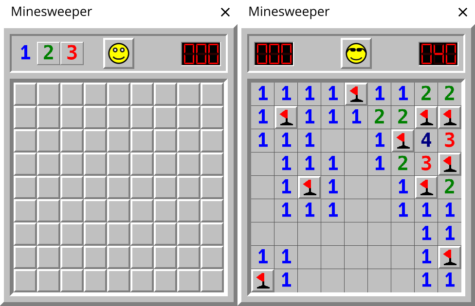

This is a clone of Minesweeper from Windows XP, written as an exercise in Odin using Raylib.



It does not have sounds. The images were drawn in Inkscape.

## Build

You need [Odin](https://odin-lang.org/) compiler installed.

Run in the project's directory:
```
odin run .
```

*WARNING*: The window may appear tiny. Raylib does not handle window scaling very well at the moment.
On Linux Wayland, scaling works when Raylib is compiled with Wayland support specifically, which is
not the case by default.

## License

Public Domain or CC0.

No LLM was used to write this code.
